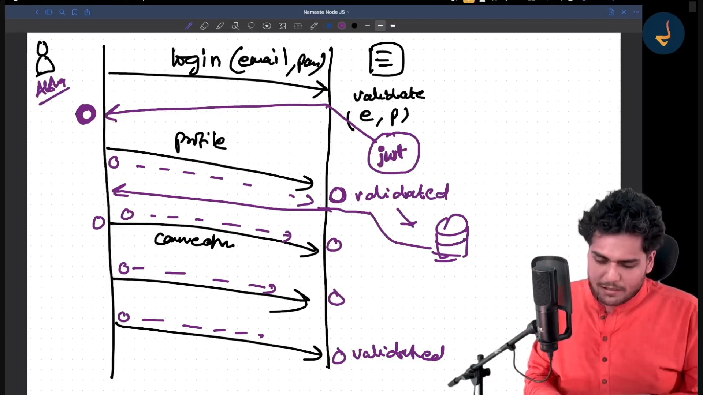
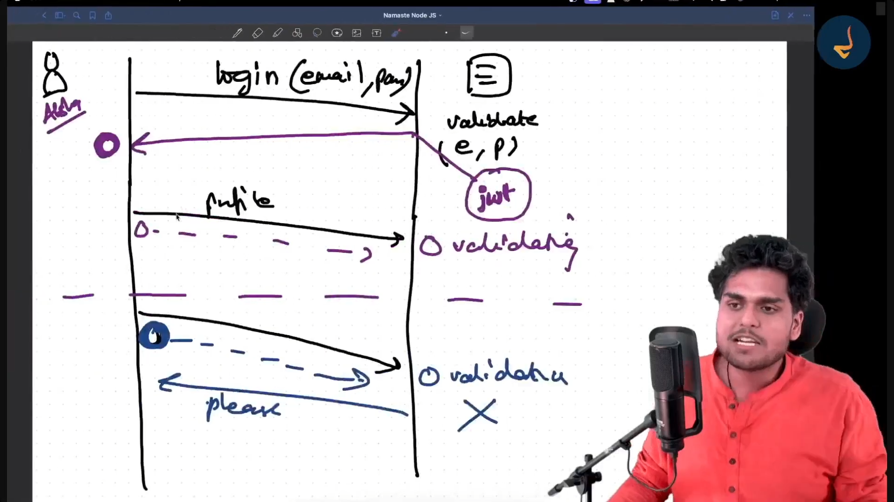

1. ⭐⭐⭐ package-lock.json v/s package.json, Should we put package-lock.json to github ?

->  Feature      	      package.json	                       package-lock.json

i)  Who creates it?	      The Developer (Manually)	           npm (Automatically)
ii) Version Type	      Flexible ranges (e.g., ^1.2.0)	   Exact versions (e.g., 1.2.5)
iii) Contains...	      Metadata, scripts, dependencies	   Detailed dependency tree + hashes
iv) Goal                  General project configuration        Consistency across environments

⭐⭐⭐ Yes, you should always commit package-lock.json to GitHub. why:

i) Identical Environments: It guarantees that every developer and server uses the exact same version of every package.
ii) Avoids "Hidden" Bugs: Without it, a teammate might accidentally install a newer, buggy version that doesn't match your local setup.
iii) Deployment Security: It uses hashes to verify that the code being downloaded hasn't been tampered with or corrupted.

2. ⭐⭐⭐ tilda (~) v/s caret (^) in versions

3. agr node modules glti se delete ho bhi jaaye tb bhi darne ki koi baat nhi hai, agr pakcage.json and package-lock.json hai project mei toh npm install se firse install ho jayenge node modules.

4. ⭐⭐⭐ what are dependencies ? 

-> dependencies are external pieces of code (libraries, packages, or modules) that your project needs to function correctly.

-> In a Node.js project, dependencies are managed via NPM (Node Package Manager) and are listed in your package.json file. There are two main types: dependencies & devDependencies

5. ⭐⭐⭐ what's the use of "-g" while npm install ? 

-> The -g flag stands for Global. When you use it during an npm install, you are telling NPM to install the package at the system level rather than just inside your current project's node_modules folder.

-> ab isse hum kisi or project mei bhi if node modules chaiye honge toh vo hum inhe access kr skte hai , baar baar hr project ke liye node modules install krne ki alag se need nhi pdegi.

6. Order of the routes matter alot.

7. Some diff routing styles:

/.*fly$/ -> iska mtlb ye hai ki kuch bhi likho but agr vo dly se end horha hai toh ye perfectly work krega.

/ab+c -> means start mei a and end mei c but beech mei jitne mrzi b ajaaye it'll work.

/ab?c -> it makes b optional , /ac bhi work krega fine.

/a(bc)?d -> this makes bc optional, ad bhi work krega.

8. Hum jitni mrzi bhi route handlers use krte hai, apne acc.

9. Express tb tk nhi rukta jab tk use apne response nhi mil jaata from the server, so middlewares se paas hoke us request handler pr pahonchtaa hai jaha usko kuch response mil jaata hai vhaa it stops. vrna next next hokr neeche tk line by line check krta rehta hai code ko.

10. ⭐⭐⭐⭐ Middlewares: 

-> A Middleware is a function that sits between the request received by the server and the final response sent to the client. It has access to the Request object (req), the Response object (res), and the next middleware function in the application’s request-response cycle, usually denoted by a variable named next.

-> The next() function: This is the most important part. If a middleware doesn't send a response, it must call next() to pass control to the next function. Otherwise, the request will be left hanging.

⭐⭐⭐⭐ Request Handler:

-> A Request Handler is a function that accepts the Request and Response objects as arguments. Its job is to process the incoming data, perform any necessary operations (like database queries), and decide whether to pass the request forward or send a response back.

11. ⭐⭐⭐⭐ vvvimp from interview pov: Middlewares , request handlers, route handlers 

12. GET /users => middlewares => request handler (yhaa stop ho jaega kyuki server ko uska response mil jayega jo vo user ko bhej ske) 

13. ⭐⭐⭐⭐ How express JS handles requests behind the scenes ? Super duper imp h iska toh bs bitha le dimaag mei ache se

-> i)  The Middleware Stack (Pipeline)
Express is essentially a series of middleware function calls. When a request hits the server, it enters a pipeline. Express executes these functions in the exact order they are defined in your code.

-> ii) The next() Mechanism :
This is the core of Express execution. Every middleware has access to a next() function.

If a middleware calls next(), Express looks at its internal Layer Stack to find the next matching route or middleware.

If next() is not called and a response is not sent, the request hangs.

-> iii) Layer and Route Matching :
Internally, Express maintains an array of Layers. Each layer contains:

A path (regex).
A handle (the function).
A method (GET, POST, etc.).
Express iterates through this array. If the incoming URL and HTTP method match the Layer's criteria, the handler is executed.

14. ⭐⭐⭐⭐ Difference between app.use() & app.all() :

15.  ⭐⭐⭐⭐ Why do we need middlewares ?

16. Error handling using app.use("/", (err, req, res, next)); -> agr err add krna h toh humesha isi format mei add hoga, sbke aage agr iski jghaa badli toh code hi mess up ho jaega, yehi convention follow krna h always for adding err in request handler. ye cheez humesha end of the code mei rkhni hai vrna vaise hr middleware ke liye use try nd catch block ispe rely nhi krna but hum ye app.use("/", (err, req, res, next)) isliye use krlete h if by chance poore code mei kuch break hua kahi track nhi huaa toh km se km ye err ko krle handle. 

17. mongoose -> it's a very good library to create schema, talk to database.

18. MongoDB is a source-available, cross-platform, document-oriented database program. classified as a NoSQL database product.

19. All the JS packages are posted on npm, it's the largest node management lib for JS.

20. ⭐⭐⭐⭐ CRUD OPERATIONS ARE VERY IMP...⭐⭐⭐⭐

21. ⭐⭐⭐⭐ CommonJS (CJS) v/s ECMAScript Modules (ESM) ⭐⭐⭐⭐

22. Server -> DB -> collections

23. We can also wrap the routes inside an array, it will make no difference.
app.use("/route", [rH, rH2, rH3, rH4, rH5]);

24. Proper way of making a DB connection: pehle DB se connect krvao server ko then listen at the server.

25. Schema -> ek trh se kisi bhi collection ko define krna ki iske andar kya kya parameters/fields honge, for ex: user collection will have user schems, user ka firstname, lastname etc etc

26. ⭐⭐⭐ Models, schema -> inki definition

i) Schema (The Blueprint): 

-> A Schema defines the structure of your document.
-> It’s like a form or a template that tells MongoDB, "Hey, every user must have a name (which is a string), an email, and an age (which is a number).

-> It defines the properties (fields).
-> It defines the data types (String, Number, Boolean).
-> It sets rules (e.g., "Email is required," "Password must be at least 8 characters").

ii) Model :

-> A Model is a wrapper on the Mongoose schema. It provides an interface to the database for creating, querying, updating, and deleting records.
-> The Schema is just a definition; the Model is what actually does the work.
-> When you call new User() or User.find(), you are using the Model.

27. Jab bhi koi DB operations kro toh always wrap them inside a try catch block.

28. Mongoose is as a bridge between your Node.js code and your MongoDB database.

29. Jab hum new User({...}) likhte hai, toh asal mein ek Naya Document create hota hai, just like new entry jise hum mongoDB ki bhaasha mei document bolte hai.

30. ⭐⭐ JS object v/s JSON 

->  JS Object :
Ye JavaScript code ka hissa hai. Isme aap functions chala sakte ho:

-> JSON :
Ye sirf ek text hai. Agar aapne browser se server pe data bhejna hai, toh aap use JSON bana dete ho.

⭐ JSON.stringify(object): Jab aapko apna JS Object kisi server ko bhejna ho (Text mein badalna ho).
⭐ JSON.parse(string): Jab server se koi JSON (text) aaye aur aapko use wapas JS Object banana ho taaki aap user.name karke access kar sako.

31. ⭐⭐ Middleware: app.use(express.json()) ⭐⭐

-> JSON data bheja ja raha hai: Bilkul sahi. Jab hum Postman ya Frontend (React/Angular) se data bhejte hain, toh wo ek String (text format) ki tarah travel karta hai.

-> Middleware (express.json()): Ye ek Watchman ki tarah hai. Jaise hi request server ke andar enter karti hai, ye middleware usey beech mein hi rok leta hai.

-> Convert JSON to JS Object: Correct. Ye us "JSON String" ko parse karta hai aur use ek "JavaScript Object" bana deta hai.

-> Taaki Express us data ko req.body naam ke ek object mein daal sake.

⭐⭐⭐⭐ SHORT SUMMARY ⭐⭐⭐⭐ :-
~ Client (Postman/Browser) -> Sends JSON String.
~ Express Server -> Receives Request.
~ express.json() Middleware -> Parses JSON String → Converts to JS Object.
~ req.body -> Ab developers is object ko use karke data access kar sakte hain (e.g., req.body.firstName).

32. empty filter pass krne pr saara data consider hojata hai.

33. User.findOne() ka use krte hi agr for ex: 2 ya usse zda users ki same id hai toh ye method sirf ek hi document return krega, User.find() us emails ke saare docuemnts return krdega, findOne() ka kaam hi yahi hai ki jaise hi use pehla document milega jo aapki condition (email) ko satisfy karta hai, wo wahi ruk jayega aur result return kar dega.

34. Any field/parameter which isn't added in the schema will never be updted in the database.

35. What are the options in a Model.findOneAndUpdate method, explore more about it ?

36. Some DB checks :

-> Kisi bhi schhema field ko mandatory krna hai toh use this "required": true means ye field chahiye hi chhaiye humei user ko database mei register krvane ke liye.

-> Jaise if i want ki 2 users ki same mail id nhi ho skti, yaa fir agr ek abari ek email se registration hogyi hai toh usse dubaara allowed nhi hai so just add "unique" field into your emailId schema, meaning ye field unique hai ekdum, 2 same entries  aren't allowed.

-> agr "default" daala hai kahi means ki agr user vo default waala field fill nhi kr rha toh jo db schema mei default value humne di hai vo vha aa jayegi apne aap. for ex: photoUrl agr kisi ne apni pic nhi attach kri toh vhaa jo humne DB mei default di hai dummy image vo show hoyegi fir.

-> trim use krne se agr kahi pr bhi for ex: user email id likh rha h but usmei beech beech m spaces daal rha hai toh trim use krne se email id without spaces save hogi, jitni bhi space hogi vo saari automcatically remove ho jaayegi bs. vrna mongoDB space waali mail id ko new mail id ki trh smjh lega which we don't want agr trim function use nhi kraa toh.

38. Valid function by default tabhi run hoga jab hum new document create kr rhe hai, agr already existing document mei ye valid fn add krna hai toh runValidators: true krne padenge in the api itself.

39. Humesha sbse pehle db ko connect krvaana hai, fir hi server ko listen krvaana hai, kyuki db connection ko lil time lgta h start hone m toh vo hojaaye fir server listen krega kuch.

40. ⭐ req.params?.userId; -> iska use tb hota hai jab url ke raste se mei koi data server tk pahonchaana chaahti hu like, userId maine url mei hi deti so iske liye mje params use krna pdega.

41. Api and db dono levels pr validations add hojaati hai.

42. Never trust req.body, password jo DB mei save hota hai that should always be saved in "encrypted / hashing format" that no one can read it, and for security purposes also this is a very good practice.

43. Humesha documentation ko refer kro kahi bhi atko toh, make it a habit yr...

44. ⭐ bcrypt.compare(password, user.password); ye method humesha jo password user ne likha hai usko hash password se compare krega, agr dono same nhi hue toh user login hi nhi kr paayega. 

45. ⭐ bcrypt is used for password encryption purposes.

46. ⭐ bcrypt.hash(password, 10); -> ye normal password jo user type krta hai uska hash password bnaa deta hai, 10 here refers to the salt rounds, 10 ek bht bdiaa no. hai isse hashed password bht strong create hojaata hai koii fir ise decrypt nhi kr skta , agr yhaa 1 daalte means bht hi weak hashed password koi bhi hacker pta lga skta tha kyaa hai asli password, or agr 100 daalte toh vo kaafi zda hojaata fir bht time lgta simple paswd ka hash bnaane mei, so 10 is the apt no. here. 

47.  bcrypt.compare(myPlaintextPassword, hash) -> ye humesha 2 parameters lega

48. ⭐⭐ IMP CONCEPTS - JWT TOKEN AND COOKIES ⭐⭐ : isko bht ache se smjh

-> 

-> 

49. JWT humesha cookie ke andar hoga.

50. To read a cookie we need a cookie parser (isntall the library), then only we will be able to read that cookie.

51. Every jwt token (jsonwebtoken) has 3 parts:

-> header

-> payload/secret data to be hidden inside the token.

-> signature -> this is used as a checker to check whether the token is correct or not, so likewise no hacker can every play with our token.

52. ⭐⭐ Token-based Authentication :

i) Authentication Phase (Login API)

-> Credential Verification
    Server receives emailId & password
    Fetches user from DB
    Uses bcrypt to compare plain password with hashed password

-> Token Generation
    On success, generate JSON Web Token (JWT)
    Payload contains user _id
    Signed using secret key stored in .env

-> Set Cookie
    Token sent via Set-Cookie header
    Browser automatically stores it

ii) Authorization Phase (Get Profile API)

-> Stateless Requests
    HTTP is stateless → server doesn’t remember user
    Browser sends cookie automatically with each request

-> Parse Cookies
    Use cookie-parser middleware
    Extract token from req.cookies

-> JWT Verification
    Use jwt.verify() with secret key
    If invalid/expired → error
    If valid → decode _id

-> Database Lookup
    Fetch user using User.findById(_id)

-> Response
    Send user data (exclude sensitive fields like password)

iii) Key Concepts :

-> JWT Structure
    Header + Payload + Signature

-> Security
    Store secret key in .env (never expose in code)

-> Bcrypt
    Hashing passwords → never store plain text

-> Middleware
    Needed because Express can’t read cookies by default

iv) Cookies vs LocalStorage :

Why Cookies?
-> Use httpOnly flag
-> Prevents JS access → protects from XSS attacks
-> More secure than LocalStorage for tokens

53. Token & cookie expiration jab hum set krdete hai toh iska mtlb itne time ke baad user ko firse login krna pdega, good amout of time is 7 days usually.

54. ⭐ this keyword doesn't works with arrow functions, it breaks the code if used here.

55. userSchema.methods.getJWT & userSchema.methods.validatePassword helper functions bnaa liye, kyuki hr user ka token create hona tha and sbka hi password validate hota toh iski wajhe se app.js mei mera code or zda enat and clean hogyaa. 

56. jab bhi bht bda project bn rha ho jaha bht saari api's tb uske liye use express router, same api's jo same usecase mei ho unka group krke ek router se route krdo aise routes bnaane hai.

57. API's ka naam itna clear hona chhaiye ki pdhte hi samajh aajayega ki ye api kya purpose solve kr rhi hai.

58. ⭐⭐ TS CODE JO SAMAJH NHI AAYA ⭐⭐

⭐ import type { Request, Response } from 'express';

-> iska ye mtlb hai ki -> JavaScript mein jab hum import karte hain, toh woh cheez memory load karti hai. Lekin TypeScript mein Request ya Response jaisi cheezein sirf Labels hain.

-> Normal Import: Yeh compiler se kehta hai, "Is cheez ko asli JavaScript file mein bhi rakho."

-> Import Type: Yeh compiler se kehta hai, "Ise sirf check karne ke liye use karo, aur jab JavaScript banao toh ise poori tarah delete kar do."

⭐ req.user = user as unknown as IUser;

-> The Problem: user data Mongoose se aa raha hai jo thoda complex hota hai, aur req.user sirf IUser format mangta hai. Dono ka design match nahi karta.

-> The "unknown": as unknown likhne se hum data ki purani pehchan (Mongoose document) mita dete hain taaki TS confuse na ho.

-> The "IUser": as IUser likhne se hum usey naya label de dete hain, taaki req.user ki pocket mein woh fit aa jaye aur aapko code likhte waqt auto-suggestions milein.

⭐ interface IUser {
    firstName: string;
    lastName?: string;
    emailId: string; 
    password: string;
    gender: string
    age: number;
}

interface AuthRequest extends Request {
    user?: IUser;
}

-> IUser (The Rulebook): Yeh ek template hai jo bata raha hai ki ek "User" ke paas kya-kya hona chahiye (jaise name, email, age). Yeh aapke code ko disciplined rakhta hai taaki aap galti se age mein string na daal dein.

-> AuthRequest (The Upgrade): Yeh Express ki standard Request ko upgrade kar raha hai. Humne usey bola: "Saari normal cheezein toh rakho hi, par saath mein ek user naam ki extra pocket bhi bana do jisme IUser wala data rakha ja sake."

⭐ interfaces (The Blueprint)
Jab aap kisi object ka structure define kar rahe ho:

-> Pattern: I + Name
Examples: IUser, IProduct, IOrder.

59. forgot password waale logic m login kbhi nhi hoga user, iska logic ye hua na ki user login krna chaahta h but usko apna password yaad nhi aarha so he/she will forget the password, receive an email for changing it aise h ye...

60. for security purposes humesha token ko hash krke hi save krna hai db mei.

61. Professional backend systems (jaise Auth0, Firebase, ya bade startups) kabhi bhi reset tokens ko "Plain Text" mein DB mein nahi rakhte.

Passwords hamesha Bcrypt se hash hote hain.

Reset Tokens hamesha sha256 se hash hote hain.

62. Hashing is a one way process only ek baar token hash hogyaa , db mei save hogya toh hacker kbhi iska plain text ptaa lgaa hi nhi paayega it's nearly impossible toh is wajhe se data safe rhega fir in DB.

63. crypto Node.js ka ek built-in module hai jiska main kaam hai Security. Ye aapke data ko protect karne ke liye mathematical algorithms (hashing, encryption) provide karta hai. ye 2 kaam krta hai: Random String Generate Karna (Tokenization) & Hashing (Data ko Mask karna).

64. crypto.randomBytes(32) ka use karke hum ek unique "Secret Key" banate hain.

65. import { Document } from "mongoose" Kyu Kiya?
Document Mongoose ka ek base interface hai jisme wo saare methods pehle se likhe hote hain jo ek Mongoose object ke paas hone chahiye (jaise .save(), .remove(), etc.).

Jab hum likhte hain interface IUser extends Document, toh iska matlab hai:

IUser ke paas apne khud ke fields toh honge hi (firstName, age, etc.).

Saath hi saath, uske paas Document ki saari powers (methods) bhi aa jayengi.

66. FULL FLOW OF FORGOT PASSWORD API:

⭐ User clicks "Forgot Password" and types their email
⭐. Your server checks — does this email exist in DB?

❌ Not found → still say "If email exists, link has been sent" (don't reveal anything)
✅ Found → continue

⭐ Server puts that token inside a link and emails it to the user
⭐ User opens email, clicks the link → browser automatically sends a GET request with the token in the URL
⭐ Server checks that token against DB:

❌ Not found → "Invalid link"
❌ Expired → "Link expired, request a new one"
✅ Valid → Show "Enter new password" form

⭐ User types new password and submits
⭐ Server hashes the new password and saves it in DB
⭐ Server deletes the token so the same link can never be used again
⭐ User is redirected to login with their new password ✅

67. https://yourapp.com/reset-password?token=a3f9bc...
                                  ↑
                          everything after ? 
                          is a 'query parameter'

    agr is url se token nikaalna hai toh req.query hi krna pdega 

68. Humesha koi bhi API bnaate waqt saare corner cases target krne hai vrna hacker can hack it very easiy, code buggy ho jayega, which we don't want ever.

69. ⭐⭐ Schema.pre :- 'pre save hook'

Node.js aur Mongoose mein pre method ka matlab hota hai ek "Middleware" jo kisi specific action (jaise database mein data save karna) ke pehle execute hota hai.

Ise "Pre-save Hook" bhi kehte hain. Iska main kaam ye hai ki data database mein permanent store hone se pehle aap us par kuch logic apply kar sakein

70. ⭐⭐ BLOCKING V/S NON-BLOCKING CODE ⭐⭐ :- ye merse ek test mei poocha gya tha make sure u tell it properly next time if asked

Node.js is built on an asynchronous architecture, which makes it important to understand how code execution is handled. 

-> Blocking Code:

Synchronous Execution: The execution of additional JavaScript in the Node.js process must wait until a non-JavaScript operation completes.

Thread Stalling: The Event Loop is unable to continue running JavaScript while a blocking operation is occurring.

Performance Impact: If a blocking call takes too long, the entire application becomes unresponsive to other users or requests.

Examples: Standard library methods that end with Sync (like fs.readFileSync) are blocking.

-> Non-Blocking Code:

Asynchronous Execution: These operations allow the Node.js process to initiate a task and move on to the next line of code without waiting for the task to finish.

Callback/Promise Based: Once the background task (like reading a file or a database query) is done, it notifies the main thread via a callback or a promise.

High Concurrency: This allows Node.js to handle thousands of concurrent connections on a single thread.

Examples: Asynchronous methods like fs.readFile or app.listen are non-blocking.

71. ⭐⭐⭐⭐⭐ "Document" in Node.js (Mongoose):-

In the context of Node.js and MongoDB (using Mongoose), a Document is a single instance of a Model.

-> Structure: It is a JSON-like data structure (BSON) that represents one individual record in a database collection
-> Representation: In your code, when you fetch a user or create a new one, that specific user object is the "Document."
-> Behavior: Documents have their own built-in methods (like .save(), .remove()) and represent the actual data stored in MongoDB.

72. ⭐⭐⭐⭐ Definition of Middlewares in Node.js -

Middlewares are functions that have access to the Request object (req), the Response object (res), and the next middleware function in the application’s request-response cycle.

The "Middle" Man: They sit between the raw request coming from the client and the final intended route handler.

⭐ Middlewares are used to:

Execute any code (like logging or authentication).
Make changes to the request and response objects (like adding user data to req.user).
End the request-response cycle.
Call the next middleware in the stack using next().

Types: Common examples include pre-save hooks in Mongoose or Express middlewares like express.json() for parsing data.

73. cookieParser() ek middleware hai jo HTTP request header se cookies ko extract karne aur unhe ek readable format (JavaScript object) mein convert karne ke liye use hota hai.

74. ⭐⭐⭐⭐⭐  vvvv imppp

Jab client request bhejta hai, toh server ke http request header mein wo cookie pahunchti hai. Phir:

-> cookieParser() us raw header se cookie nikaalta hai.
-> Tumhara backend us cookie ke andar se JWT extract karta hai.
-> Phir tum us JWT ko verify karte ho.

75. Sql v/s NoSql ??

76. $or query $and query in mongoose :

i. $or Query
Jab aap chahte ho ki agar koi ek condition bhi true ho jaye toh result mil jaye, tab $or use karte hain. Iska syntax ek array leta hai jisme multiple objects (conditions) hoti hain.

Example Scenario: Aapko aise users chahiye jo ya toh Delhi mein rehte ho ya unka status Interested ho.

Syntax:

JavaScript
const users = await User.find({
    $or: [
        { city: "Delhi" },
        { status: "interested" }
    ]
});
Mtlb: Agar user Delhi ka hai (chahe status kuch bhi ho) ya status interested hai (chahe city koi bhi ho), toh wo result mein aa jayega.

ii. $and Query
Jab aap chahte ho ki saari conditions true honi chahiye, tab $and use hota hai.

Example Scenario: Aapko aise users chahiye jo Delhi mein rehte ho AUR unka gender Female ho.

Syntax:

JavaScript
const users = await User.find({
    $and: [
        { city: "Delhi" },
        { gender: "female" }
    ]
});

77. schema.pre("save") function:

Mongoose mein schema.pre("save") ek Middleware (jise Hook bhi kehte hain) hai jo kisi bhi document ko database mein actually save hone se thik pehle execute hota hai.

78. Read more about indexes in DB?

i. Indexes Ka Asli Maqsad:

Database mein jab lakhon records hote hain, toh search query boht slow ho jati hai. Indexing database ki Search Speed ko boost karti hai, taaki results milliseconds mein mil jayein.

Bina Index ke: DB ko puri table scan karni padti hai (O(n) complexity).

Index ke saath: DB ek optimized structure (usually B-Tree) use karta hai (O(log n) complexity).

ii. Mongoose mein Index kaise lagayein?
Mongoose mein aap Schema level par indexing define kar sakte ho:

TypeScript
const userSchema = new mongoose.Schema({
    emailId: {
        type: String,
        required: true,
        unique: true,     // Ye automatically ek 'unique index' bana deta hai
        index: true       // Manual index banane ke liye
    }
});

iii. Types of Indexes in Mongoose:

Single Field Index: Kisi ek field par index (jaise emailId).

Compound Index: Jab do ya do se zyada fields par milakar search karna ho.

Example: userSchema.index({ firstName: 1, lastName: 1 });

Unique Index: Jo ensure kare ki value duplicate na ho (jaise emailId).

79. why do we need index in DB?

i. Search Speed: Bina index ke DB ko pura Collection Scan (har ek record check karna) karna padta hai, jo slow hota hai.

ii. Server Efficiency: DB ko kam documents scan karne padte hain, jisse CPU aur RAM par load kam padta hai.

iii. Sorting: Agar tumhe users ko "Newest First" dikhana hai, toh indexing sorting ko boht fast bana deti hai.

80. what is the advantage and disadvantage of creating indexes?

Advantages of Creating Indexes 🚀

Faster Data Retrieval
Query Performance
Reduced CPU & RAM Usage
Efficient Sorting
Data Integrity (Unique Indexes)

Disadvantages of Creating Indexes 🐢

Storage Space
Slower Write Operations (INSERT/UPDATE/DELETE)
Index Maintenance
Overhead on Memory

Summary Tip for your Notes 🚀

Hamesha Selective Indexing karo. Sirf un fields par index lagao jinhe tum find() queries mein baar-baar use karte ho. Bina soche har field par index lagana fayde se zyada nuksaan de sakta hai!

81. read about compound indexes.

⭐ What is it?
Agar tum sirf firstName par index lagate ho, toh wo "Single Field Index" hai. Lekin agar tum firstName aur lastName dono ko milakar ek index banate ho, toh wo Compound Index hai.

⭐ Syntax in Mongoose
Isse hamesha schema level par define kiya jata hai:

⭐ 1 ka matlab data ascending order mei store hoga , -1 ka matlab data Descending order mei store hoga
userSchema.index({ firstName: 1, lastName: 1 });

82. mongoose.Schema.Types.ObjectId -> basically ye objectId store krleta hai user ki jisko mei further populate krke user ka saara data nikaal skti hu, uska name, gnder, age , mail etc etc.

Mongoose ObjectId (mongoose.Schema.Types.ObjectId) :-

-> Asli Pehchaan: Ye ek unique address ki tarah hai jo MongoDB ke kisi specific document ko point karta hai.

-> Auto-Validation: Mongoose khud check karta hai ki ID ka format sahi hai ya nahi; String ki tarah ye galat data save nahi hone deta.

-> Populate ka Magic: Iske use se .populate() method kaam karta hai, jo ID ko hata kar uski jagah poora user data (naam, photo) dikha deta hai.

-> Storage mein Chhota: Ye binary format mein hota hai, isliye String ke mukable kam jagah leta hai.

-> Super Fast: Database mein search karte waqt ye String se boht zyada tez kaam karta hai.

-> Best for Linking: Jab bhi do collections ko aapas mein jodna ho (jaise User aur Post), tab hamesha ObjectId hi use karte hain.

83. Model baate waqt humesha 2 parameters dene hote hai : model name & schema name.

84. Params humesha vo fields ke liye use hoga jo via url jaa rhe hai, jaise ki toUserId ye waali object id via params jaayegi, status ye sb via url jaayega, 
connection req waali api mei.

85. unique: true,        // Ye automatically ek 'unique index' bana deta hai
    index: true          // Manual index banane ke liye

86. A MongoDB query is a specific request or command sent from your application to the database to perform operations on data. Unlike traditional databases that use SQL, MongoDB uses a flexible, JSON-like syntax (BSON) to interact with documents.

Think of it as a filter or a set of instructions that tells MongoDB exactly what you want to do with your data.

87. Indexes memory (RAM/Disk) lete hain. Agar aapne bahut saare indexes bana diye, toh aapka database size kaafi badh jayega. Ise "Over-indexing" kehte hain. so use indexing wisely.

88. Indexing = High Speed Search = Happy User.

89. Ab indexing ke kuch types hote hai like : 1 | -1 | '2d' | '2dsphere' | 'geoHayStack' | 'hashed' | 'text':

1 -> arrange data in ascending order

-1 -> arrange data in descending order

'2d' aur '2dsphere' (Geospatial Indexes) -> used for Uber, Zomato, ya Tinder jahan location-based search hoti hai.

'hashed' -> Yeh data ki actual value ko ek "hash code" mein badal deta hai.

'text' -> used for Keyword Search -> for ex: "Search for 'iPhone' in description"

90. agr res.send() ya res.json() ke saath 'return' keyword use nhi kra toh aage ka code bhi run ho jaayega jisse err aayega "Headers already sent". So, it's a must to use return keyword always.

91. Read about ref and populate

92. Solution: .populate kya karta hai ki us ID ko pakadta hai, User collection mein jaata hai, aur wahan se us bande ki asli details (naam, photo, skills) utha kar le aata hai. jisse ki humaare user schema and connection req schema aapas mei connect hogye.

93.  ⭐ Interviews mei aise bhi pooch skte hai vo log ki: koi api build krni hai toh uske peeche ka thought process btaao basically they see ki aap kisi cheez ko build krne ke liye kaisi approach use kroge, poora proper code nhi bhi poochte sometimes.

94. skip and limit logic for mongoDB:

/feed?page=1&limit=10 => 1-10 users => .skip(0) & .limit(10) [it means skip 0 and give the first 10 users]

/feed?page=2&limit=10 => 11-20 users => .skip(10) & .limit(10)

/feed?page=3&limit=10 => 21-30 users => .skip(20) & .limit(10)

formula for calculating skip : skip = (page-1) * limit;

95. ⭐⭐ what is pagination ? 

